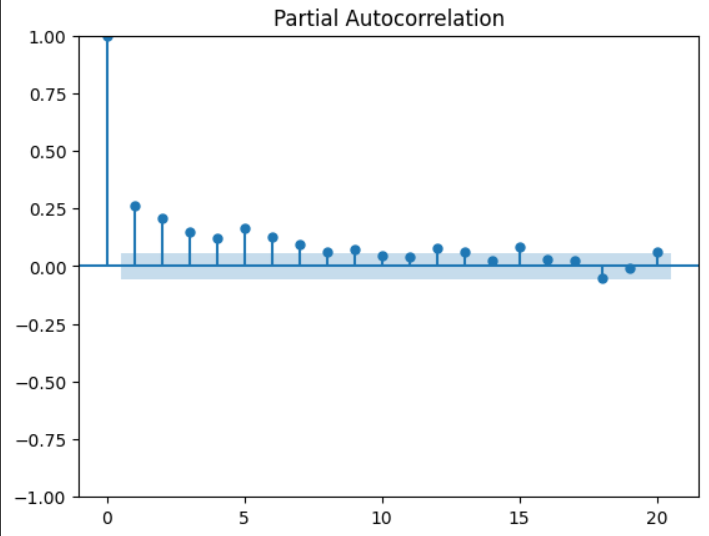

# EX.NO.09        A project on Time series analysis on weather forecasting using ARIMA model 

### Date: 
### Developed by: Shaik Shoaib Nawaz
### Register numbers: 212222240094

### AIM:
To Create a project on Time series analysis on Power Consumption using ARIMA model in  Python and compare with other models.
### ALGORITHM:
1. Explore the dataset of weather 
2. Check for stationarity of time series time series plot
   ACF plot and PACF plot
   ADF test
   Transform to stationary: differencing
3. Determine ARIMA models parameters p, q
4. Fit the ARIMA model
5. Make time series predictions
6. Auto-fit the ARIMA model
7. Evaluate model predictions
### PROGRAM:
```
import numpy as np
import pandas as pd
import matplotlib.pyplot as plt
import seaborn as sns
from statsmodels.tsa.stattools import adfuller, acf, pacf
from statsmodels.tsa.arima.model import ARIMA
from sklearn.metrics import mean_squared_error
import warnings
warnings.filterwarnings("ignore")
from statsmodels.graphics.tsaplots import plot_acf, plot_pacf # This line is added to import the necessary plotting functions

data = pd.read_csv("/content/KwhConsumptionBlower78_1.csv")
data.head()
data.plot(figsize=(10,5))
plt.title("Power Consumption Over Time")
plt.show()

def adf_test(series):
    result = adfuller(series)
    print("ADF Statistic:", result[0])
    print("p-value:", result[1])
    return result[1] < 0.05  # True if stationary #Fixed: Indentation corrected to align with function body
is_stationary = adf_test(data["Consumption"])

if not is_stationary:
    data_diff = data["Consumption"].diff().dropna()
    plt.plot(data_diff)
    plt.title("Differenced Power Consumption")
    plt.show()
else:
    data_diff = data["Consumption"]

plot_acf(data_diff, lags=20) # Assuming 'plot_acf' is imported from statsmodels.graphics.tsaplots
plt.show()

plot_pacf(data_diff, lags=20) # Assuming 'plot_pacf' is imported from statsmodels.graphics.tsaplots
plt.show()

p, d, q = 1, 1, 1  # example values; adjust based on plots

model = ARIMA(data["Consumption"], order=(p, d, q))
fitted_model = model.fit()
print(fitted_model.summary())

forecast_steps = 12  # Number of months to forecast
forecast = fitted_model.forecast(steps=forecast_steps)

last_date = pd.to_datetime(data['TxnDate'].iloc[-1])  # Convert to datetime if necessary
forecast_index = pd.date_range(last_date + pd.DateOffset(months=1), periods=forecast_steps, freq='MS') 

plt.plot(data["Consumption"], label="Historical Data") 
plt.plot(forecast_index, forecast, label="Forecast", color='orange')
plt.legend()
plt.title("Power Consumption Forecast")
plt.show()
```

### OUTPUT:
Power Consumption over time:


Autocorrelation:


Partial Autocorrelation:


Model summary:


Power Consumption Forecast:


### RESULT:
Thus the project on Time series analysis on Power Consumption based on the ARIMA model using python is executed successfully.
